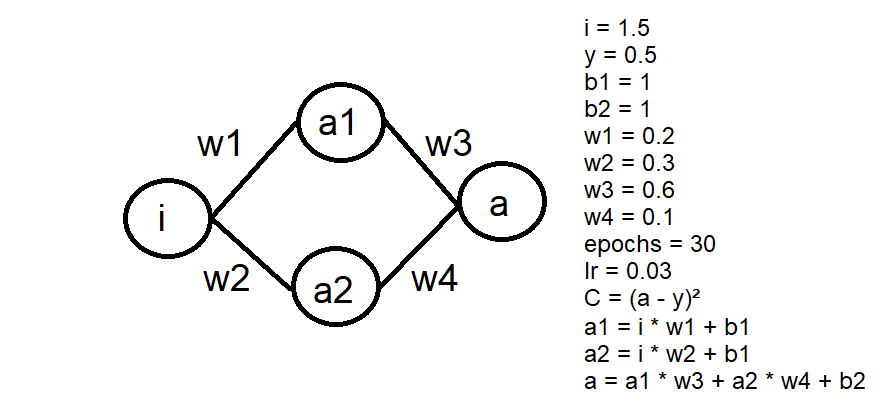
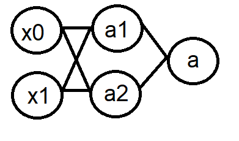

## Redes Neurais
Regressão linear e regressão logística são apenas os dois modelos mais simples de Machine Learning. Com esses modelos, temos claras limitações devido à falta de complexidade. Nesse contexto, as redes neurais foram desenvolvidas para que se pudesse construir modelos muito mais profundos, capazes de resolver uma gama muito maior de problemas. <br>
Para conseguir entender as redes neurais, é extremamente necessário que você, após entender a teoria, bote a mão na massa e tente fazer suas próprias redes, a fim de entender como todo o processo dela funciona. <br>
Abaixo temos duas abas, recomendamos que você veja os vídeos para aprender a teoria, e depois tente fazer os códigos por conta, apenas consultando quando surgirem dúvidas. 

### Recomendações
[Redes neurais - 3b1b](https://www.youtube.com/playlist?list=PLZHQObOWTQDNU6R1_67000Dx_ZCJB-3pi): é uma ótima série de vídeos para se ter uma visão inicial sobre os conceitos de Redes Neurais, principalmente. Recomenda-se começar o estudo de Redes Neurais com essa playlist.

[Coursera - Advanced Learning Algorithms](https://www.coursera.org/learn/advanced-learning-algorithms?specialization=machine-learning-introduction#syllabus): continuação do curso visto na sessão anterior, agora focando em Redes Neurais e conselhos em relação à Machine Learning no geral. 


### Exercícios para fixação
Redes neurais são extremamente complicadas de entender sem praticar, principalmente a backpropagation, que envolve muita matemática. 
Por causa disso recomenda-se tentar implementar redes neurais à mão, o qual é o objeto dos exercícios a seguir<br>

**Exercício 1**:<br>
Desenvolva uma rede neural trivial para obter o valor desejado de y, conforme imagem abaixo:


O *learning rate* e o número de épocas fica a seu critério. Os valores da imagem são apenas como referência.
É recomendado tentar resolver esse exercício de maneira simples, apenas utilizando um laço *for* para iterar por múltiplas épocas do treino. O objetivo desse exercício é ter um primeiro contato com o forward e backward pass, observando como muda a loss, o peso e o valor de saída da rede.

 **Exercício 2**:<br>
Modifique o exercício anterior, adicionando uma camada oculta com 2 neurônios e um bias para cada camada, conforme a imagem abaixo:

Preste atenção em como a loss cai em comparação ao exercício anterior. 

**Exercício 3**:<br>
Construa uma rede neural que simule o portão lógico XOR. 
```python
# Tabela verdade XOR
x = [[0,0], [1, 0], [1, 1], [0, 1]]  
y = [0, 0, 1, 0]
```
Para resolver esse problema, é necessário utilizar os conhecimentos obtidos dos exercícios anteriores de forward e backward pass, e adicionar a função de ativação Sigmoide na camada de saída, já que o XOR não é linearmente separável. Diagrama da rede:<br>
<br>
Os pesos devem ser inicializados utilizando a função [randn do NumPy](https://numpy.org/doc/stable/reference/random/generated/numpy.random.randn.html) e os bias devem ser 1. <br>
Para esse exercício, utilize o learning rate de 0.2 e 5000 épocas como referência. <br>
É esperado que ao final do treino a loss convirja para próximo de 0, e a rede neural acerte todas combinações da XOR.

**Exercício 4**:<br>
Generalize o exercício anterior, adicionando uma classe para as camadas e outra para a própria rede neural.<br>
Segue abaixo uma sugestão para a interface das classes:<br>
```python
class Layer:  
    def __init__(self, n_of_inputs, n_of_neurons, activation, bias):  
        pass
  
    def forward(self, x):  
        pass
  
    def backward(self, chain_rule_derivatives):  
	pass
  
 class NeuralNetwork:  
    def __init__(self, input_size, lr):  
        pass
  
    def forward(self, x):  
        pass
  
    def backward(self, loss_derivative):  
        pass
  
    def append_layer(self, output_number, activation, bias):  
	pass
``` 
Utilize a biblioteca NumPy para construir as matrizes dos pesos e dos bias.

**Exercício 5**:<br>
Utilizando a rede construída no exercício anterior, construa um modelo para classificar as imagens dos dígitos escritos à mão do [dataset MNIST](https://en.wikipedia.org/wiki/MNIST_database). 
Baixe o dataset [diretamente](http://yann.lecun.com/exdb/mnist/) ou utilizando o [PyTorch](http://yann.lecun.com/exdb/mnist/)

### Resoluções dos exercícios
É fundamental olhar as resoluções somente após tentar fazer os exercícios por conta. <br>
[Exercícios 1 e 2](https://github.com/petcomputacaoufrgs/Machine-Learning-/blob/main/Códigos/dummy_neural_network.ipynb)<br>
[Exercício 3](https://github.com/petcomputacaoufrgs/Machine-Learning-/blob/main/Códigos/xor_simple.ipynb)<br>
[Exercício 4](https://github.com/petcomputacaoufrgs/Machine-Learning-/blob/main/Códigos/xor_from_scratch.ipynb)<br>
[Exercício 5](https://github.com/petcomputacaoufrgs/Machine-Learning-/blob/main/Códigos/mnist_from_scratch.ipynb)<br>